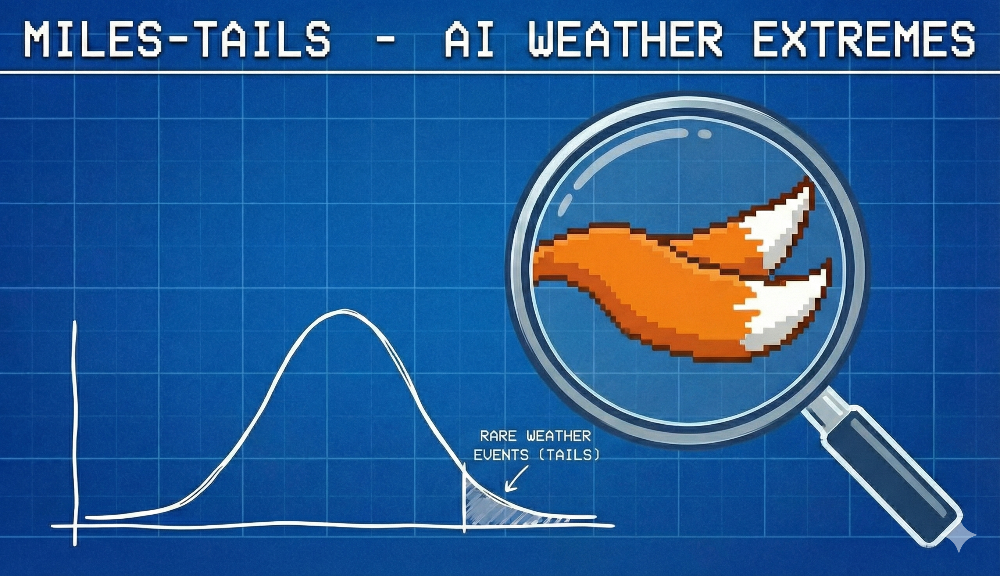

# MILES-TAILS: Rare Event Sampling for AI Weather Prediction

<p align="center">
  
</p>

[](https://www.python.org/downloads/)
[](https://opensource.org/licenses/MIT)

Forward Flux Sampling for hurricane genesis probability estimation in AI weather models. Multi-interface importance sampling with tropical cyclone tracking to efficiently compute rare event rates. Features parallel execution, extratropical filtering, MSLP-based detection, and comprehensive logging.

## Overview

This package implements Forward Flux Sampling algorithms to estimate the probability of rare atmospheric events—like hurricane genesis—in AI-based weather forecasting systems. Standard Monte Carlo sampling requires millions of trajectories to observe even a single hurricane formation. FFS provides a 10-1000× speedup through importance sampling along interfaces.

**Current implementation:** Atlantic basin hurricane genesis probability estimation from AI weather model forecasts.

## Key Features

- **Forward Flux Sampling Framework**: Multi-interface importance sampling with automatic flux estimation
- **Multi-Storm Tracking**: Simultaneous detection and tracking of multiple tropical cyclones
- **Tropical Cyclone Classification**: Extratropical filtering with latitude/longitude rules
- **Parallel Execution**: Multi-GPU support with thread-safe configuration management
- **Production-Ready**: Comprehensive logging, verification checks, and visualization output

## Installation

```bash
git clone https://github.com/NCAR/miles-tails.git
cd miles-tails
pip install -e .
```

**Requirements:**
- Python 3.9+
- PyTorch
- xarray, numpy, scipy
- Cartopy (for visualization)
- CREDIT framework (for AI weather models)

## Quick Start

```python
from tails.ffs import HurricaneGenesisFFS_Clean
from credit.models import load_model
from credit.transforms import Normalize_ERA5_and_Forcing

# Load your AI weather model
model = load_model(config, load_weights=True).to('cuda')
state_transformer = Normalize_ERA5_and_Forcing(config)

# Initialize FFS
ffs = HurricaneGenesisFFS_Clean(
    model=model,
    state_transformer=state_transformer,
    config=config,
    initial_dataset=dataset,
    dataset_params=dataset_params,
    state_A=1008,           # No organized system (hPa)
    state_B=982,            # Hurricane strength (hPa)
    interfaces=[1000, 988, 980, 975, 970],  # Progressive intensification
    output_dir='./ffs_results'
)

# Run FFS algorithm
ffs.run_ffs(
    initial_loader=data_loader,
    n_flux_trials=100,      # Flux generation trajectories
    n_shoot_trials=50       # Shooting attempts per interface
)

# Results
print(f"Hurricane genesis rate: {ffs.flux_estimate * np.prod(ffs.transition_probs):.2e} per day")
```

## Algorithm Overview

Forward Flux Sampling estimates rare event rates by:

1. **Flux Generation (Phase 0)**: Long trajectories from state A to estimate crossing rate Φ₀ at first interface λ₀
2. **Shooting (Phases 1-N)**: Short trajectories from each interface λᵢ to estimate transition probabilities P(λᵢ→λᵢ₊₁)
3. **Rate Calculation**: P(A→B) = Φ₀ × ∏ P(λᵢ→λᵢ₊₁)

**Order Parameter:** Mean sea level pressure (MSLP)
- State A: MSLP > 1008 hPa (quiescent)
- Interfaces: 1000, 988, 980, 975, 970 hPa
- State B: MSLP < 982 hPa (hurricane)

### Multi-Storm Tracking

The flux generation phase tracks multiple storms simultaneously:
- Tempest-style local minimum detection (3×3 neighborhood test)
- Automatic merging of nearby minima (< 10° separation)
- Independent tracking until dissipation (MSLP > A)
- Only NEW genesis events counted (decorrelation via state A return)

### Extratropical Filtering

Storms are rejected if:
- Latitude > 50°N (too far north)
- Latitude > 45°N AND longitude > -20°W (heading to Europe)

This ensures only tropical cyclones are counted.

## Directory Structure

```
miles-tails/
├── tails/
│   ├── __init__.py
│   ├── ffs.py                    # Main FFS implementation
│   └── logger.py                 # FFS logging utilities
├── examples/
│   ├── run_hurricane_ffs.py      # Single IC example
│   └── run_parallel_ffs.py       # Multi-IC parallel execution
├── tests/
├── docs/
├── images/
│   └── tails.png                 # Project logo
└── README.md
```

## Output Structure

```
ffs_results/
└── IC_2022-08-28/
    ├── logs/
    │   ├── flux/                 # Flux generation logs
    │   ├── 1/                    # Shooting logs (λ₀→λ₁)
    │   └── 2/                    # Shooting logs (λ₁→λ₂)
    ├── flux/                     # λ₀ crossings (configs + PNGs)
    ├── 1/                        # λ₁ crossings
    ├── 2/                        # λ₂ crossings
    └── stateB/                   # Hurricane formations
```

## Citation

If you use this code in your research, please cite:

```bibtex
@software{miles_tails_ffs,
  author = {John Schreck and MILES Group},
  title = {MILES-TAILS: Rare Event Sampling for AI Weather Prediction},
  year = {2025},
  publisher = {GitHub},
  url = {https://github.com/NCAR/miles-tails}
}
```

## References

- Allen, R. J., Warren, P. B., & ten Wolde, P. R. (2005). *Sampling rare switching events in biochemical networks*. Physical Review Letters, 94(1), 018104.
- FFS methodology adapted for atmospheric science applications

## Contributing

Contributions welcome! Please open an issue or submit a pull request.

## License

MIT License - see LICENSE file for details.

## Acknowledgments

Developed by the [MILES](https://www.cisl.ucar.edu/miles) (Machine Intelligence Learning for Earth System) group at NCAR.

This work builds on the [CREDIT](https://github.com/NCAR/miles-credit) framework for AI weather prediction.

## Contact

- **Author**: John Schreck
- **Institution**: National Center for Atmospheric Research (NCAR)
- **Group**: MILES